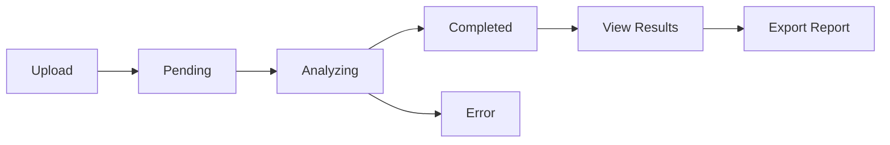

# 📁 Estructura del Proyecto Backend

```
backend/
├── 📁 backend/                    # Configuración principal de Django
│   ├── __init__.py               
│   ├── settings.py               # Configuraciones del proyecto
│   ├── urls.py                   # URLs principales
│   ├── wsgi.py                   # Configuración WSGI
│   ├── asgi.py                   # Configuración ASGI (WebSocket)
│   └── celery.py                 # Configuración de Celery
│
├── 📁 contracts/                  # App principal de contratos
│   ├── __init__.py
│   ├── models.py                 # Modelos de datos
│   ├── serializers.py            # Serializers de DRF
│   ├── views.py                  # ViewSets y APIs
│   ├── urls.py                   # URLs del app
│   ├── admin.py                  # Panel de administración
│   ├── apps.py                   # Configuración del app
│   ├── tests.py                  # Tests unitarios
│   ├── migrations/               # Migraciones de BD
│   └── fixtures/                 # Datos iniciales
│       └── initial_contract_types.json
│
├── 📁 ml_analysis/               # App de análisis ML
│   ├── __init__.py
│   ├── ml_service.py             # Servicio principal ML
│   ├── models.py                 # Modelos ML auxiliares
│   ├── apps.py
│   ├── migrations/
│   └── management/
│       └── commands/
│           ├── train_ml_model.py
│           └── process_pending_contracts.py
│
├── 📁 media/                     # Archivos subidos por usuarios
│   └── contracts/               # Archivos de contratos
│
├── 📁 ml_models/                 # Modelos ML guardados
│   ├── modelo_clausulas_YYYYMMDD_HHMMSS.joblib
│   └── vectorizer_clausulas_YYYYMMDD_HHMMSS.joblib
│
├── 📁 static/                    # Archivos estáticos
├── 📁 templates/                 # Templates HTML (opcional)
│
├── 📄 manage.py                  # Comando principal de Django
├── 📄 requirements.txt           # Dependencias Python
├── 📄 db.sqlite3                # Base de datos SQLite
├── 📄 .env                       # Variables de entorno
├── 📄 .gitignore                # Archivos ignorados por Git
├── 📄 Dockerfile                # Configuración Docker
├── 📄 docker-compose.yml        # Docker Compose
├── 📄 API_DOCUMENTATION.md       # Documentación de API
├── 📄 setup_instructions.md     # Instrucciones de instalación
└── 📄 PROJECT_STRUCTURE.md      # Este archivo
```

## 🏗️ Arquitectura de Componentes

### **1. Modelos de Datos**
```python
# Jerarquía de modelos
ContractType (Tipos de contratos)
    ↓
Contract (Contrato principal)
    ↓
Clause (Cláusulas individuales)
    ↓
Entity (Entidades NER)

AnalysisResult (Resultados de análisis)
```

### **2. Servicios ML**
```python
# ml_analysis/ml_service.py
ContractMLService
├── _load_models()              # Carga spaCy + sklearn
├── analyze_contract()          # Análisis completo
├── _extract_clauses()          # Extracción de cláusulas
├── _analyze_clause()           # Análisis individual
├── _extract_entities()         # NER con spaCy
└── _generate_summary()         # Resumen ejecutivo
```

### **3. APIs REST**
```python
# contracts/views.py
ContractViewSet
├── GET    /api/contracts/              # Listar contratos
├── POST   /api/contracts/              # Crear contrato
├── GET    /api/contracts/{id}/         # Detalle de contrato
├── PUT    /api/contracts/{id}/         # Actualizar contrato
├── DELETE /api/contracts/{id}/         # Eliminar contrato
├── POST   /api/contracts/{id}/analyze/ # Analizar contrato
├── POST   /api/contracts/bulk_analyze/ # Análisis masivo
├── GET    /api/contracts/dashboard_stats/ # Estadísticas
└── GET    /api/contracts/{id}/export_report/ # Exportar reporte
```

### **4. Procesamiento Asíncrono**
```python
# Flujo de Celery
Usuario sube contrato → Celery Task → ML Analysis → Guardar resultados
                                   ↓
                            analyze_contract_task()
                                   ↓
                            ContractMLService.analyze_contract()
                                   ↓
                            Actualizar estado en BD
```

## 🎯 Endpoints para Frontend React

### **Dashboard Principal**
```typescript
GET /api/contracts/dashboard_stats/
→ { total_contracts, pending_analysis, high_risk, recent_contracts }
```

### **Lista de Contratos**
```typescript
GET /api/contracts/?page=1&status=completed
→ { count, next, previous, results: Contract[] }
```

### **Subir Contrato**
```typescript
POST /api/contracts/
Body: { title, contract_type, original_text, file_upload }
→ Contract con status='pending'
```

### **Analizar Contrato**
```typescript
POST /api/contracts/{id}/analyze/
→ { message, task_id, status='analyzing' }
```

### **Ver Resultados**
```typescript
GET /api/contracts/{id}/
→ Contract completo con clauses[], entities[], analysis_result{}
```

### **Exportar Reporte**
```typescript
GET /api/contracts/{id}/export_report/
→ PDF o JSON con reporte completo
```

## 🔄 Estados de la Aplicación



## 🚀 Escalabilidad

### **Base de Datos**
- **Desarrollo**: SQLite
- **Producción**: PostgreSQL
- **Índices**: contract_type, status, uploaded_by, created_at

### **Cache**
- **Redis**: Resultados de análisis frecuentes
- **Memcached**: Sesiones de usuario

### **Storage**
- **Desarrollo**: Sistema de archivos local
- **Producción**: AWS S3, Google Cloud Storage

### **Monitoreo**
- **Celery**: Flower dashboard
- **Logs**: Django logging + external service
- **Metrics**: Prometheus + Grafana

### **Deployment**
- **Containerización**: Docker + docker-compose
- **Orquestación**: Kubernetes (producción)
- **CI/CD**: GitHub Actions, GitLab CI

## 🔐 Seguridad

### **Autenticación**
- Token Authentication para API
- Session Authentication para panel admin

### **Autorización**
- Usuarios solo ven sus propios contratos
- Permisos basados en roles

### **Validación**
- Serializers de DRF
- Validación de archivos subidos
- Rate limiting en APIs críticas

### **Datos Sensibles**
- Variables de entorno (.env)
- Secrets management en producción
- Cifrado de datos sensibles

## 📊 Métricas y Monitoring

### **Métricas de Negocio**
- Contratos analizados por día
- Tiempo promedio de análisis
- Tipos de contratos más comunes
- Porcentaje de cláusulas abusivas

### **Métricas Técnicas**
- Tiempo de respuesta de APIs
- Uso de memoria y CPU
- Errores en tareas de Celery
- Disponibilidad del servicio

### **Alertas**
- Cola de Celery muy larga
- Errores de análisis frecuentes
- Uso excesivo de recursos
- Fallos de conexión a BD 